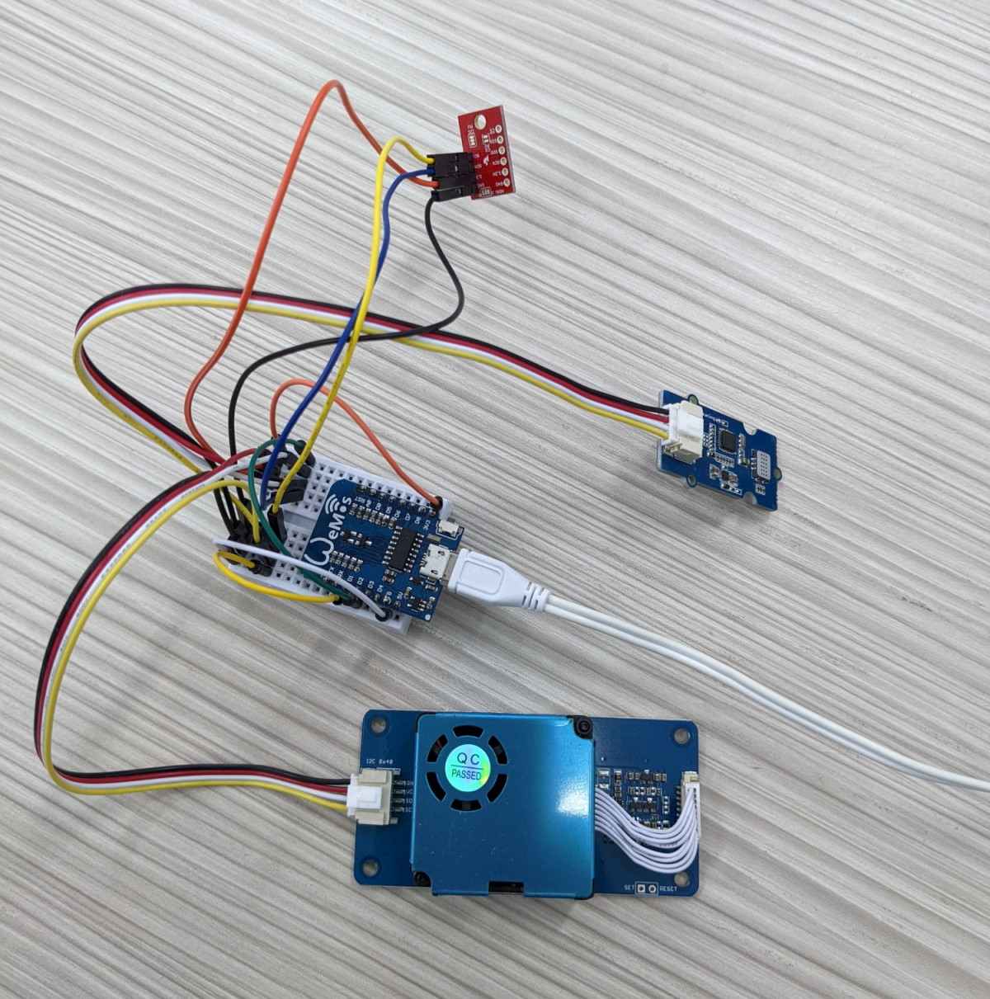

# Συσκευή μέτρησης της ποιότητας του αέρα

Η συσκευή μέτρησης ποιότητας αέρα είναι μια συσκευή η οποία έχει την
δυνατότητα να λαμβάνει και να καταγράφει τις μετρήσεις που επηρεάζουν
την ποιότητα του αέρα που αναπνέουμε. Η συσκευή είναι τοποθετημένη μέσα
στο σχολικό κτίριο του ΕΠΑΛ Καστοριάς και πραγματοποιεί μετρήσεις κάθε
ένα λεπτό.

Παρακάτω μπορούμε να δούμε τα χαρακτηριστικά του αέρα που έχει τη
δυνατότητα να μετρήσει η συσκευή.

-   Θερμοκρασία του αέρα

-   Υγρασία του αέρα

-   Συγκέντρωση του μονοξειδίου του άνθρακα

-   Συγκέντρωση του διοξείδιο του αζώτου

-   Συγκέντρωση σωματιδίων μεγέθους 1μm, 2.5μm και 10μm

Για κάθε ένα από τα παραπάνω χαρακτηριστικά του αέρα, έχουν θεσπιστεί
όρια μέσω των οποίων μπορούμε να αξιολογήσουμε την ποιότητά του. Στους
παρακάτω συνδέσμους, μπορούμε να δούμε περισσότερες πληροφορίες για
διάφορους δείκτες ποιότητας του αέρα.

-   https://ec.europa.eu/environment/air/quality/standards.htm

-   https://www.airlab.edu.gr/index.php?option=com_content&view=article&id=74&Itemid=104&lang=el

Οι μετρήσεις αποθηκεύονται σε βάση δεδομένων και προβάλλονται, με την
μορφή διαγραμμάτων, στη διεύθυνση
<https://clnt-2gym-kastor.kas.sch.gr:3000/dashboards>

# Εφαρμογές και υλικά που χρησιμοποιήθηκαν

Για την δημιουργία της συσκευής χρησιμοποιήθηκαν τα παρακάτω υλικά:

-   [ESP8266 (WeMos
    Mini)](https://www.wemos.cc/en/latest/d1/d1_mini.html)

-   [Grove - Laser PM2.5 Sensor
    (HM3301)](https://wiki.seeedstudio.com/Grove-Laser_PM2.5_Sensor-HM3301/)

-   [Grove - Multichannel Gas
    Sensor](https://wiki.seeedstudio.com/Grove-Multichannel_Gas_Sensor/)

-   [Raspberry Pi
    4](https://www.raspberrypi.com/products/raspberry-pi-4-model-b/)

-   Breadboard και καλώδια σύνδεσης

-   Τροφοδοτικό 5V

Για την αποθήκευση και προβολή των δεδομένων χρησιμοποιήθηκαν τα
παρακάτω λογισμικά:

-   Προγραμματισμός του ESP8266 με το [Arduino IDE](Arduino%20IDE)

-   Αποθήκευση των μετρήσεων στην βάση δεδομένων
    [InfluxDB](https://www.influxdata.com/)

-   Προβολή γραφημάτων με το [Grafana](https://grafana.com/)

-   Τα παραπάνω λογισμικά εγκαταστάθηκαν και παραμετροποιήθηκαν
    κατάλληλα στο Raspberry Pi 4

# Παραπομπές

-   [Εγκατάσταση ΛΣ στο Raspberry
    Pi](https://ubuntu.com/tutorials/how-to-install-ubuntu-on-your-raspberry-pi#1-overview)

-   [Εγκατάσταση
    InfluxDB](https://docs.influxdata.com/influxdb/v1.8/introduction/install/)

-   [Εγκατάσταση
    Grafana](https://grafana.com/docs/grafana/latest/installation/debian/)

# Περίοδος υλοποίησης

Το έργο υλοποιήθηκε κατά την διάρκεια του δεύτερου τετραμήνου του
σχολικού έτους 2021-2022.

# Μέλη της ομάδας

Τα μέλη της ομάδας ανήκουν στο ΕΠΑΛ Καστοριάς και είναι τα παρακάτω:

  -----------------------------------------------------------------------
  **Ονοματεπώνυμο**                   **Τάξη**
  ----------------------------------- -----------------------------------
                                      

                                      

                                      

                                      
  -----------------------------------------------------------------------

# Σχολική μονάδα

ΕΠΑΛ Καστοριάς

Εργατικές κατοικίες

52100, Καστοριά

Τηλέφωνο: 2467028206

Email:
[[mail@1epal-kastor.kas.sch.gr]{.underline}](https://github.com/ththemelis/epal-airquality/blob/main/mail@1epal-kastor.kas.sch.gr)
